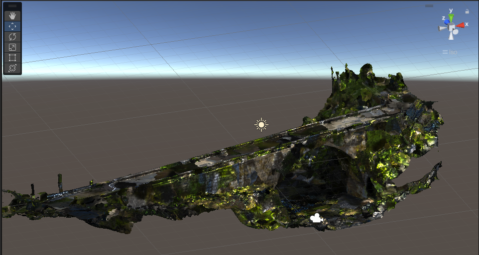
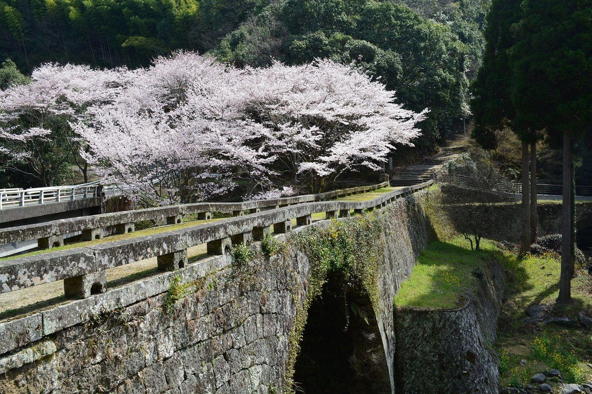

# 八瀬（八勢）眼鏡橋フォトグラメトリープロジェクト
 
このプロジェクトは、八瀬（八勢）眼鏡橋のフォトグラメトリープロジェクトです。  
このモデルは、メタバース空間上でも使えるようにしているので、可能性が広がります。
# 八瀬（八勢）眼鏡橋 （やせめがねばし）
 

矢部町（現・山都町）と御船町を結んだ日向往還の難所に、御船町の先哲・林田能寛が私財を投じ、安政2年（1855年）にわずか４ヶ月の期間で完成させた石橋。  
長さ62mと県内の石橋で最も長いのが特徴で、大・小二つの眼鏡橋からなる珍しい形をしています。熊本県指定重要文化財のひとつ。
## 場所
上益城郡御船町上野
## 概要 
八勢川と農業用水路に架かる複合的な大眼鏡橋で、長さ56m、幅4.35m、高さ10.3m。  
安政2年（1855年）3月に完成。

## 解説
### 安心して通える道路や激流に耐える橋がほしい

江戸時代から明治初期まで、熊本・御船から矢部や日向（宮崎県）への旅は、現在の御船町木倉を通り軍見坂（ぐみざか）を越える日向往還を使い、人馬の往来も多く見られました。  
その街道沿いには八勢川（やせがわ）が流れており、渓谷が深く、渡るには崖を上り下りしなければなりませんでした。  
また、橋に下る小道も傾斜が急で足場が悪く、年貢米を運ぼうとした人が、米俵をかついだまま川に転落して命を落とすことが絶えなかったといわれています。  
さらに、長雨になると激流となり、村人が命がけでつくった木橋も流され、数十日も交通がとだえることもありました。  
そのため、八勢の村の人びとは、橋を架けるために仕事を休まねばならず、そのうえ病人も医者に診せることができませんでした。

### 私財を投げうった林田能寛

木倉手永で「萬屋（よろずや）」として酒造業を営んでいた林田能寛（よしひろ）は、「事の大小を問わず、そのまま見殺しにしておれないのが私の性分。  
費用万端私におまかせ下されば、たとえ能寛は乞食に相成り果てましても、この難儀（なんぎ）を救わずにおれません」（『御船風土記』）と惣庄屋・光永平蔵に橋の建設の相談をしたと紹介されています。  
平蔵は上司の蒲池正紹に伝え、正紹はすぐに藩に請願したところ、藩の許可が下り、能寛は私財を投げうって橋の建設にとりかかりました。

### 石橋と石畳の大工事

橋の建設には通潤橋の建設を終えたばかりの種山石工・甚平・宇助が棟梁としてあたりました。   
八勢川と農業用水路に架かる複合的な大眼鏡橋で、長さ56m、幅4.35m、高さ10.3mもあり、橋に続く石畳もつくられました。  
八勢の人びとも石の運搬をはじめ、力の限り汗を流したと伝えられています。大工事は4か月におよび、安政2年（1855年）3月に完成しました。

## 紹介ページ
https://kumamoto.guide/spots/detail/11437  
https://www.mifune-kankou.jp/spot/505/

## Googleマップ
https://goo.gl/maps/5uJWbVkdrrofJsHG8
